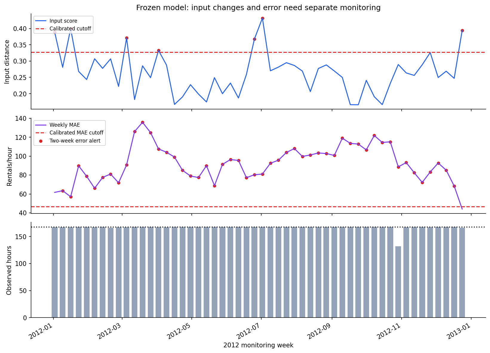

# Data Drift Detection for Bike Demand

Monitor changes in input distributions and prediction error, then compare how retraining policies respond. This project combines statistical distribution diagnostics with chronological demand estimation and known-change stress tests.

## Results

On **8,686 eligible hourly observations across 52 monitoring weeks in 2012**:

| Policy | MAE, rentals/hour | RMSE | Update fits |
|---|---:|---:|---:|
| Frozen | 91.91 | 128.05 | 0 |
| Every four completed batches | 51.46 | 79.78 | 12 |
| Two-week error trigger, four-batch cooldown | 52.32 | 81.74 | 7 |

The error-triggered policy reduces MAE by **43.1%** relative to the frozen model while using seven updates. Scheduled updates achieve slightly lower error with more fits. Update counts exclude the common initial model fit.

In 20 paired stress-test runs, multiplying demand by 1.6 leaves inputs and their alarm sequences exactly unchanged. Performance monitoring raises an alert in 95.75% of affected batches, while input alarms remain at the paired no-change background rate of 5.5%. This shows why covariate monitoring alone cannot identify every model failure.



## What is implemented

- Target-leakage checks and strict chronological train/selection/calibration/monitoring partitions.
- A mean baseline and histogram gradient boosting with October-only model selection.
- KS statistics and p-values, quantile-bin PSI, IQR-scaled Wasserstein distance, and categorical total variation distance.
- An input score with a frozen reference; empirical thresholds from 200 calibration-day-resampled weeks.
- Separate labeled-error monitoring with two consecutive weekly MAE exceedances.
- Twenty paired random seeds for no-change, sensor-bias, and conditional-demand-growth experiments.
- Frozen, scheduled, and error-triggered retraining, with predictions made before each batch's labels are used.
- An executed notebook, eight figures, ten result tables, and eight tests of data and temporal boundaries.

## Run

Use Python 3.11 or later. Pinned requirements record the tested environment. From the repository root:

```bash
python -m venv .venv
source .venv/bin/activate
python -m pip install -r requirements.txt
python -m pip install -e . --no-deps
python scripts/download_data.py
python -m pytest -q
python scripts/execute_notebook.py
```

On Windows, activate with `.venv\Scripts\activate`. The downloadable package includes the original data, so the download step may be skipped when `data/raw/hour.csv` exists. The Git repository excludes raw data.

The notebook is `notebooks/data_drift_detection.ipynb`; its executed reading copy is `notebooks/data_drift_detection.html`. Open it in JupyterLab, VS Code or another Jupyter client from the extracted repository. To use JupyterLab, install it separately with `python -m pip install jupyterlab`.

For environments that prohibit kernel sockets:

```bash
python scripts/execute_notebook.py --in-process
```

This executes the notebook's Python cells in a fresh process with IPython and records real outputs. Either execution route regenerates reports, figures, notebook outputs and HTML. Runtime depends on CPU and the repeated distribution comparisons.

## Repository guide

| Path | Purpose |
|---|---|
| `src/drift_detection/data.py` | Data validation, features and time partitions |
| `src/drift_detection/models.py` | Demand models and error metrics |
| `src/drift_detection/metrics.py` | Marginal distribution diagnostics |
| `src/drift_detection/monitoring.py` | Calibration and weekly alerts |
| `src/drift_detection/experiments.py` | Controlled paired streams and evaluation |
| `src/drift_detection/policies.py` | Predict-before-update policy comparison |
| `tests/` | Leakage, unseen-category, change and update-boundary checks |
| `reports/` | Reproducible tables, configuration and figures |
| `docs/` | Data provenance, methodology, publishing and interview notes |

## Design and limits

The task is contemporaneous hourly demand estimation given **observed weather**. It is not a forecast made before that weather is known. Weekly targets are revealed at batch end in the simulator; real deployment needs explicit label latency.

January–September 2011 train the initial model; October selects tree complexity; November–December calibrate thresholds; 2012 is monitored. All 2011 labels become eligible for future retraining windows, but only training-period labels fit the initial model. Updates use a trailing 180-day window and affect the next batch.

Seasonal weather shifts can cause input alerts without proving model failure. The short calibration season, day-level resampling, marginal-only input metrics and assumed label availability limit generalization. KS p-values are diagnostic under temporal dependence. Empirical thresholds do not guarantee a nominal deployment false-alarm rate. Natural 2012 data have no ground-truth change dates; detector precision and recall are therefore not reported for that stream.

## Data and sources

[Fanaee-T, H. (2013), Bike Sharing, UCI](https://doi.org/10.24432/C5W894), license **CC BY 4.0**. The hourly dataset contains 17,379 observed records from 2011–2012. See [data provenance](docs/data.md) for the download link and checksum.

Primary technical references: [SciPy KS](https://docs.scipy.org/doc/scipy/reference/generated/scipy.stats.ks_2samp.html), [SciPy Wasserstein distance](https://docs.scipy.org/doc/scipy/reference/generated/scipy.stats.wasserstein_distance.html), and [scikit-learn histogram gradient boosting](https://scikit-learn.org/stable/modules/generated/sklearn.ensemble.HistGradientBoostingRegressor.html).

Code: MIT license. Dataset: separate CC BY 4.0 terms. See [publishing instructions](docs/publishing.md) to push the repository and its history to GitHub.
